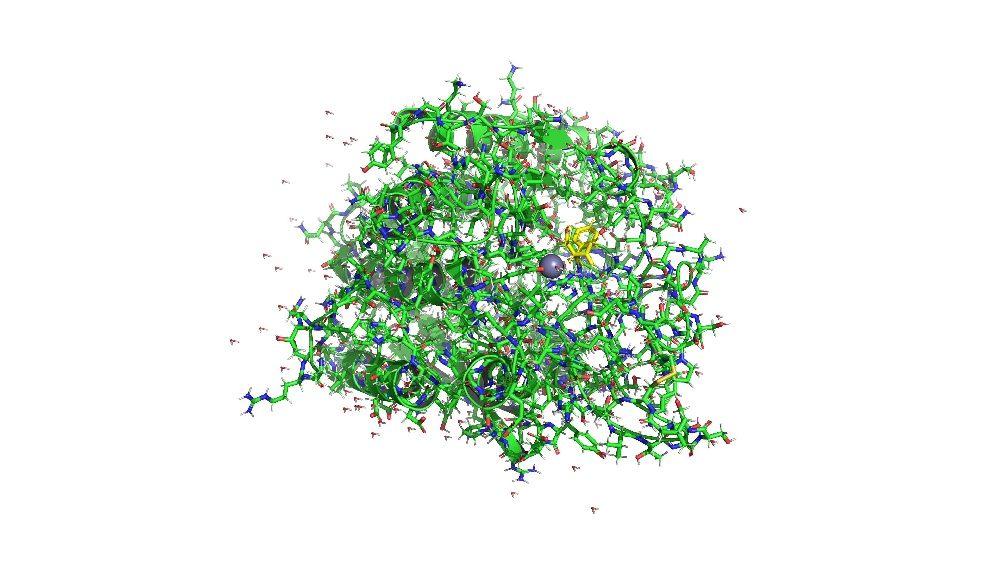
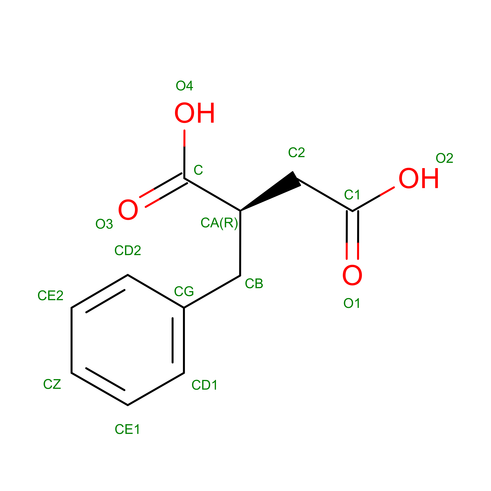

# Topology Example (with Ligands)

| Structure                                 | Ligand                             |
| ----------------------------------------- | ---------------------------------- |
|  |  |

## Inputs

- **Structure**: `1CBX.pdb` — Carboxypeptidase A with bound inhibitor L-Benzylsuccinate.
- **Ligand Template**: `BZS.mol2` — Tripos MOL2 template for the BZS hetero residue.

## Command

```bash
bioforge topology -i 1CBX.pdb --hetero-template BZS.mol2 -o 1CBX-topology.cif --out-format mmcif
```

## Results

- Builds a bonded topology containing both the protein and `BZS` ligand using the provided template.
- Emits mmCIF with `_struct_conn` categories populated so downstream tools retain ligand bonds.
